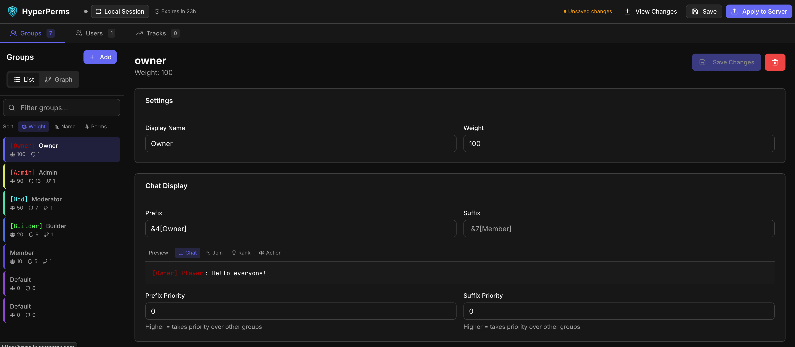

# HyperPerms

[](https://github.com/HyperSystemsDev/HyperPerms/releases)
[](LICENSE)
[](https://discord.com/invite/aZaa5vcFYh)
[](https://github.com/HyperSystemsDev/HyperPerms)

**The permission system for Hytale.** Web editor, templates, and everything you need out of the box.

**[Documentation](https://www.hyperperms.com/wiki)** | **[Web Editor](https://hyperperms.com)** | **[Discord](https://discord.com/invite/aZaa5vcFYh)**



## Features

**Web Editor** - Edit permissions in your browser at [hyperperms.com](https://hyperperms.com). No port forwarding needed.

**Permission Templates** - Pre-built roles (admin, moderator, builder, member) ready to use.

**Contextual Permissions** - Scope permissions per-world, per-region, or per-server.

**Wildcard Support** - `plugin.command.*` matches all subpermissions automatically.

**Tracks & Inheritance** - Promotion tracks with weight-based group priority.

**Timed Permissions** - Temporary permissions with automatic expiration and cleanup.

**VaultUnlocked Integration** - Economy and chat prefix/suffix support out of the box.

**Analytics & Auditing** - Track permission usage, view hotspots, and audit change history.

**High Performance** - LRU caching, async operations, and efficient permission resolution.

**LuckPerms Migration** - One-command import from LuckPerms (YAML, JSON, H2, SQLite).

## Quick Start

1. Drop `HyperPerms-2.7.7.jar` in your `mods/` folder
2. Start your server
3. Run `/hp editor` to open the web editor, or use commands:

```
/hp group create admin              # Create a group
/hp group admin permission set *    # Grant all permissions
/hp user Steve parent add admin     # Add player to group
/hp template apply moderator        # Apply pre-built template
```

## Commands

| Command | Description |
|---------|-------------|
| `/hp editor` | Open web-based permission editor |
| `/hp user <player> info` | View player's permissions |
| `/hp user <player> permission set <perm>` | Set a permission |
| `/hp user <player> parent add <group>` | Add player to group |
| `/hp group create <name>` | Create a new group |
| `/hp group <name> permission set <perm>` | Set group permission |
| `/hp track <name> promote <player>` | Promote on a track |
| `/hp template apply <name>` | Apply permission template |
| `/hp migrate luckperms` | Import from LuckPerms |
| `/hp reload` | Reload configuration |

<details>
<summary><strong>All Permissions</strong></summary>

| Permission | Description |
|------------|-------------|
| `hyperperms.admin.*` | Full admin access |
| `hyperperms.user.*` | User management |
| `hyperperms.group.*` | Group management |
| `hyperperms.track.*` | Track management |

</details>

## Configuration

Config file: `mods/com.hyperperms_HyperPerms/config.json`

<details>
<summary><strong>View full config</strong></summary>

```json
{
  "storage": {
    "type": "json"
  },
  "cache": {
    "enabled": true,
    "maxSize": 10000,
    "expireAfterAccessMinutes": 10
  },
  "defaultGroup": "default",
  "webEditor": {
    "enabled": true,
    "apiUrl": "https://api.hyperperms.com"
  },
  "analytics": {
    "enabled": false,
    "trackChecks": true,
    "trackChanges": true,
    "retentionDays": 90
  },
  "console": {
    "clickableLinksEnabled": true
  }
}
```

</details>

## Important: Vanilla Group Overwrite

Hytale's built-in permission system forcibly resets the `OP` and `Default` groups every time the server starts. Any custom permissions added to these groups via `/perm` will be **lost on restart**. Always use HyperPerms groups instead (`/hp group create <name>`). HyperPerms logs a warning at startup if it detects custom permissions in vanilla groups.

## Optional: SQLite & Analytics

SQLite enables analytics tracking and audit logs. It's **not bundled** to keep the JAR small (2.4MB vs 15MB).

<details>
<summary><strong>Enable SQLite features</strong></summary>

1. Download from [sqlite-jdbc releases](https://github.com/xerial/sqlite-jdbc/releases/)
2. Place the JAR in `mods/com.hyperperms_HyperPerms/lib/`
3. Restart your server

**Without SQLite:** Everything works fine - analytics is simply disabled and JSON storage is used.

**Analytics commands:**
- `/hp analytics summary` - Permission health overview
- `/hp analytics hotspots` - Most checked permissions
- `/hp analytics audit` - Change history

</details>

## For Developers

<details>
<summary><strong>Maven Dependency (JitPack)</strong></summary>

Add HyperPerms as a dependency to build integrations:

```gradle
repositories {
    maven { url 'https://jitpack.io' }
}

dependencies {
    compileOnly 'com.github.HyperSystemsDev:HyperPerms:v2.8.5'
}
```

</details>

<details>
<summary><strong>API Usage</strong></summary>

```java
HyperPermsAPI api = HyperPerms.getApi();

// Check permissions
User user = api.getUserManager().getUser(uuid).join();
boolean canBuild = user.hasPermission("world.build");

// Add contextual permission
Node node = Node.builder("world.build")
    .value(true)
    .withContext("world", "creative")
    .build();
user.addPermission(node);

// Create a group
Group admin = Group.builder("admin")
    .weight(100)
    .addPermission(Node.builder("*").build())
    .build();
api.getGroupManager().createGroup(admin);
```

</details>

<details>
<summary><strong>Building from Source</strong></summary>

**Requirements:** Java 25, Gradle 9.3+

All dependencies are resolved automatically from Maven. The Hytale Server API comes from `maven.hytale.com` and VaultUnlocked from `repo.codemc.io`.

```bash
./gradlew shadowJar
# Output: build/libs/HyperPerms-<version>.jar
```

See [CONTRIBUTING.md](CONTRIBUTING.md) for full development setup and contribution guidelines.

</details>

## Links

- [Documentation](https://www.hyperperms.com/wiki) - Full wiki and guides
- [Discord](https://discord.com/invite/aZaa5vcFYh) - Support & community
- [Issues](https://github.com/HyperSystemsDev/HyperPerms/issues) - Bug reports & features
- [Releases](https://github.com/HyperSystemsDev/HyperPerms/releases) - Downloads

---

Part of the **HyperSystems** suite: [HyperPerms](https://github.com/HyperSystemsDev/HyperPerms) | [HyperHomes](https://github.com/HyperSystemsDev/HyperHomes) | [HyperFactions](https://github.com/HyperSystemsDev/HyperFactions) | [HyperWarp](https://github.com/HyperSystemsDev/HyperWarp)
