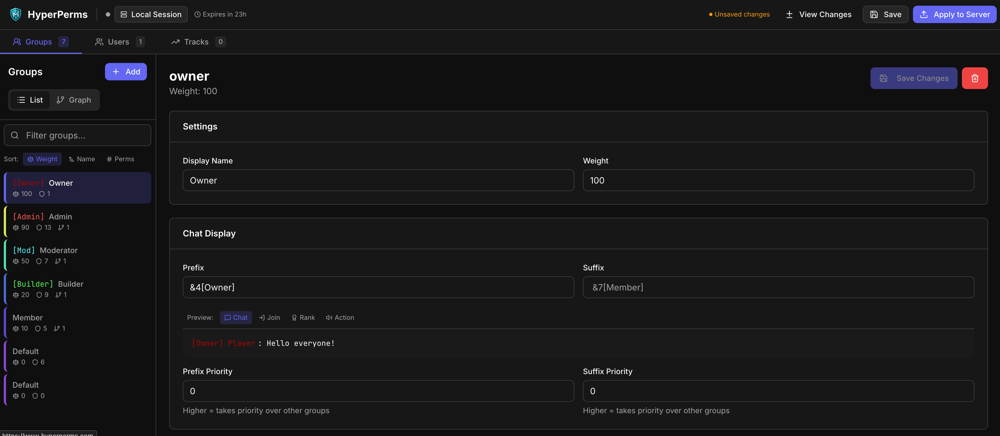

# HyperPerms

[](https://github.com/HyperSystems-Development/HyperPerms/releases)
[](LICENSE)
[](https://discord.com/invite/aZaa5vcFYh)
[](https://github.com/HyperSystems-Development/HyperPerms)

**The permission system for Hytale.** Web editor, 11 server templates, plugin integrations, and everything you need out of the box.

**[Documentation](https://www.hyperperms.com/wiki)** | **[Web Editor](https://hyperperms.com)** | **[Discord](https://discord.com/invite/aZaa5vcFYh)** | **[CurseForge](https://www.curseforge.com/hytale/mods/hyperperms)**

> **Version 3.0.0 targets Hytale Update 6 (`0.6.0-pre.x`) and does not run on 0.5.x.** Update 6
> changed `PermissionProvider` and the player-list packet in ways that cannot be supported from one
> build. **Running Hytale 0.5.x? Stay on HyperPerms 2.10.x.**
>
> The headline change for operators: **the whitelist is now the `hytale.server.join` permission.**
> Grant it to a HyperPerms group to whitelist that group. See
> [HYTALE_PERMISSIONS.md](HYTALE_PERMISSIONS.md#update-6-060-the-whitelist-is-now-a-permission).



## Features

**Web Editor** — Edit permissions in your browser at [hyperperms.com](https://hyperperms.com). Drag-and-drop groups, visual inheritance graphs, smart autocomplete with 300+ permissions, and live chat preview. No port forwarding needed. Want to self-host? The editor is [open source](https://github.com/HyperSystemsDev/HyperPermsEditor) and can run offline on your own infrastructure.

**11 Server Templates** — Survival, RPG, factions, skyblock, prison, creative, SMP, towny, minigames, vanilla, and staff. One command gives you groups, permissions, inheritance, prefixes, and tracks.

**Plugin Integrations** — First-class support for VaultUnlocked, MMOSkillTree (200+ nodes), HyperFactions, PlaceholderAPI, MysticNameTags, and WerChat. Auto-detected, zero configuration.

**Storage Backends** — JSON (default), SQLite, or MariaDB/MySQL with HikariCP connection pooling for multi-server networks.

**Contextual Permissions** — Scope permissions per-world, per-gamemode, or per-server.

**Wildcards & Negation** — `plugin.command.*` matches all subpermissions. `-hytale.command.spawn` denies explicitly.

**Tracks & Inheritance** — Promotion/demotion tracks with weight-based group priority and unlimited inheritance depth.

**Timed Permissions** — Temporary permissions and group membership with automatic expiration (`1d`, `2h30m`, `1w`).

**Analytics & Auditing** — Track permission usage, view hotspots, and audit change history (requires SQLite).

**Runtime Discovery** — Automatically scans installed plugins and discovers their permission nodes. Discovered permissions appear in the web editor with "Installed" badges.

**LuckPerms Migration** — One-command import from LuckPerms (YAML, JSON, H2, MySQL/MariaDB). Automatic backup before migration.

## Quick Start

1. Drop `HyperPerms.jar` in your `mods/` folder
2. Start your server
3. Run `/hp editor` to open the web editor, or use commands:

```
/hp template apply survival          # Instant rank hierarchy
/hp group create admin               # Create a group
/hp group admin setperm *            # Grant all permissions
/hp user Steve addgroup admin        # Add player to group
```

## Commands

| Command | Description |
|---------|-------------|
| `/hp editor` | Open web-based permission editor |
| `/hp user <player> info` | View player's groups and permissions |
| `/hp user <player> setperm <perm> [value] [duration]` | Set a permission (optionally temporary) |
| `/hp user <player> addgroup <group> [duration]` | Add player to group |
| `/hp user <player> promote <track>` | Promote on a track |
| `/hp group create <name>` | Create a new group |
| `/hp group <name> setperm <perm> [value] [duration]` | Set group permission |
| `/hp group <name> parent add <parent> [duration]` | Add parent group |
| `/hp template list` | List available templates |
| `/hp template apply <name>` | Apply a server template |
| `/hp check <player> <perm>` | Test a permission |
| `/hp debug toggle <category>` | Toggle debug logging |
| `/hp backup create [name]` | Create a backup |
| `/hp migrate luckperms [--confirm]` | Import from LuckPerms |
| `/hp reload` | Reload configuration |

<details>
<summary><strong>All Permissions</strong></summary>

| Permission | Description |
|------------|-------------|
| `hyperperms.command.*` | Full admin access |
| `hyperperms.command.user.*` | User management |
| `hyperperms.command.group.*` | Group management |
| `hyperperms.command.track.*` | Track management |
| `hyperperms.command.check.self` | Check own permissions |
| `hyperperms.command.check.others` | Check other players' permissions |

</details>

## Configuration

Config file: `mods/com.hyperperms_HyperPerms/config.json`

<details>
<summary><strong>View full config</strong></summary>

```json
{
  "storage": {
    "type": "json"
  },
  "cache": {
    "enabled": true,
    "maxSize": 10000,
    "expireAfterAccessMinutes": 10
  },
  "defaultGroup": "default",
  "webEditor": {
    "enabled": true,
    "apiUrl": "https://api.hyperperms.com"
  },
  "analytics": {
    "enabled": false,
    "trackChecks": true,
    "trackChanges": true,
    "retentionDays": 90
  },
  "console": {
    "clickableLinksEnabled": true
  }
}
```

**Storage types:** `"json"` (default), `"sqlite"`, `"mariadb"`, `"mysql"`

For MariaDB/MySQL, add connection details:
```json
{
  "storage": {
    "type": "mariadb",
    "host": "localhost",
    "port": 3306,
    "database": "hyperperms",
    "username": "root",
    "password": "",
    "poolSize": 10,
    "useSSL": false
  }
}
```

</details>

## Important: HyperPerms and Operator (OP) status

HyperPerms registers as the **primary** permission provider (it puts itself first while keeping Hytale's built-in provider registered). All permission *decisions* are made by HyperPerms.

Hytale determines **operator status by group membership** — internally it checks whether a player is in the `hytale:Admin` group. To make this work for HyperPerms-managed admins, HyperPerms automatically reports a player as being in `hytale:Admin` whenever they effectively have the `*` permission (e.g. via the bundled `admin`/`owner` groups). So **granting a HyperPerms group the `*` node makes its members OP**, recognized by Hytale and OP-gated features.

Manage everything through HyperPerms:

- Use `/hp` commands (e.g. `/hp group create <name>`), **not** Hytale's vanilla `/perm` or `/setgroup` — those operate on Hytale's built-in data, and `/perm reload` does not reload HyperPerms (use `/hp reload`).
- Grant admin/operator access by putting a player in a HyperPerms group that has the `*` node (the bundled `admin`/`owner` groups do). Hytale's vanilla `/op self` is advisory-disabled while HyperPerms is active.

## Optional: SQLite & Analytics

SQLite enables analytics tracking and audit logs. It's **not bundled** to keep the JAR small (~7MB vs ~20MB).

<details>
<summary><strong>Enable SQLite features</strong></summary>

1. Download from [sqlite-jdbc releases](https://github.com/xerial/sqlite-jdbc/releases/)
2. Place the JAR in `mods/com.hyperperms_HyperPerms/lib/`
3. Restart your server

**Without SQLite:** Everything works fine — analytics is simply disabled and JSON storage is used.

**Analytics commands:**
- `/hp analytics summary` — Permission health overview
- `/hp analytics hotspots` — Most checked permissions
- `/hp analytics audit` — Change history

</details>

## For Developers

<details>
<summary><strong>Maven Dependency (JitPack)</strong></summary>

Add HyperPerms as a dependency to build integrations:

```gradle
repositories {
    maven { url 'https://jitpack.io' }
}

dependencies {
    compileOnly 'com.github.HyperSystems-Development:HyperPerms:2.9.5'
}
```

</details>

<details>
<summary><strong>API Usage</strong></summary>

```java
HyperPermsAPI api = HyperPerms.getApi();

// Check permissions
User user = api.getUserManager().getUser(uuid).join();
boolean canBuild = user.hasPermission("world.build");

// Add contextual permission
Node node = Node.builder("world.build")
    .value(true)
    .withContext("world", "creative")
    .build();
user.addPermission(node);

// Create a group
Group admin = Group.builder("admin")
    .weight(100)
    .addPermission(Node.builder("*").build())
    .build();
api.getGroupManager().createGroup(admin);
```

</details>

<details>
<summary><strong>Building from Source</strong></summary>

**Requirements:** Java 25, Gradle 9.3+, Hytale 0.6.0+

The Hytale Server API is resolved automatically from `maven.hytale.com`. The **pre-release channel is the default**, because 3.x targets Update 6 (`0.6.0-pre.x`); `-Phytale_channel=release` or `./gradlew buildRelease` is retained for when Update 6 promotes to the release channel and will not compile before then. PlaceholderAPI comes from `repo.helpch.at`. VaultUnlocked is a compile-only soft dependency supplied as a jar in `libs/` (from [TheNewEconomy/VaultUnlocked-Hytale](https://github.com/TheNewEconomy/VaultUnlocked-Hytale)).

```bash
./gradlew shadowJar
# Output: build/libs/HyperPerms-<version>.jar
```

See [CONTRIBUTING.md](CONTRIBUTING.md) for full development setup and contribution guidelines.

</details>

## Links

- [Documentation](https://www.hyperperms.com/wiki) - Full wiki and guides
- [Discord](https://discord.com/invite/aZaa5vcFYh) - Support & community
- [Issues](https://github.com/HyperSystems-Development/HyperPerms/issues) - Bug reports & features
- [Releases](https://github.com/HyperSystems-Development/HyperPerms/releases) - Downloads

---

Part of the **[HyperSystems](https://github.com/HyperSystems-Development)** suite: [HyperPerms](https://github.com/HyperSystems-Development/HyperPerms) | [HyperEssentials](https://github.com/HyperSystems-Development/HyperEssentials) | [HyperFactions](https://github.com/HyperSystems-Development/HyperFactions)
